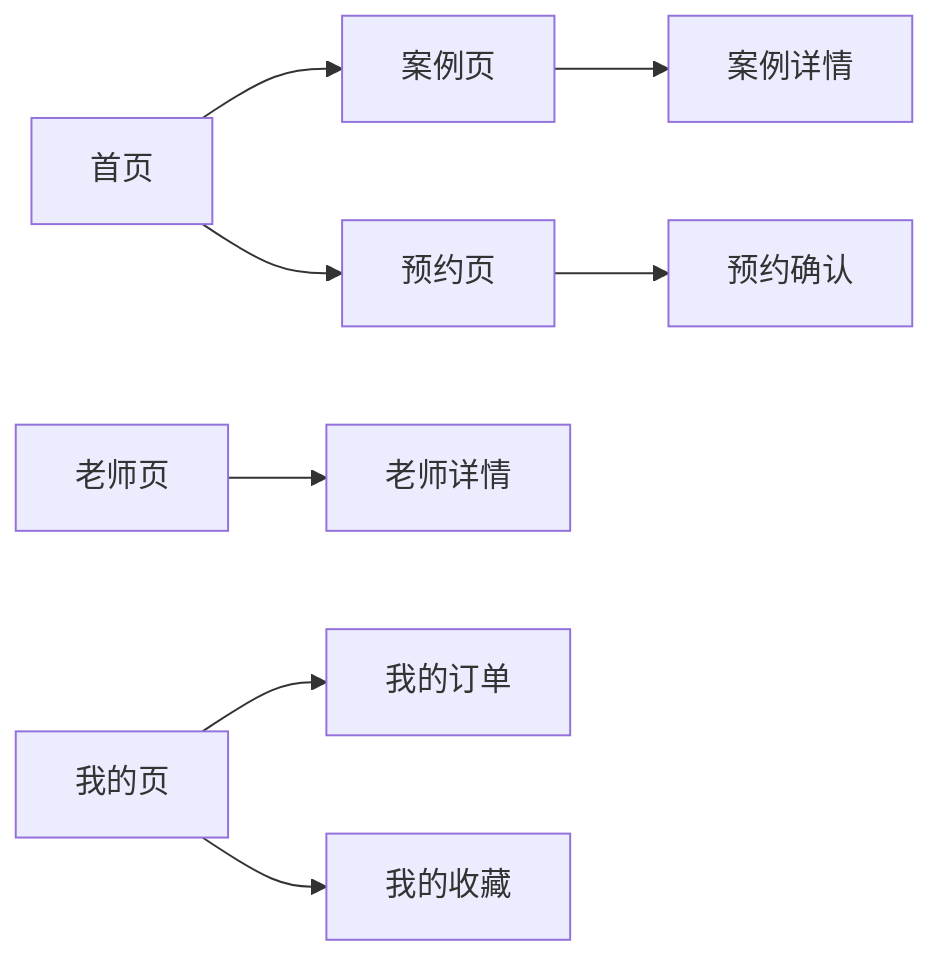

# 美妆小程序详细页面 PRD

> **文档版本**：v1.0  
> **更新日期**：2026-06-07  
> **适用范围**：轻奢美妆 Demo H5 / 小程序视觉验证  
> **关联文档**：[首页开发文档](../README.md)

---

## 目录

- [1. 文档说明](#1-文档说明)
- [2. 产品背景与目标](#2-产品背景与目标)
- [3. 路由与信息架构](#3-路由与信息架构)
- [4. 全局设计规范](#4-全局设计规范)
- [5. 页面详细需求](#5-页面详细需求)
  - [5.1 首页](#51-首页-home)
  - [5.2 案例页](#52-案例页-cases)
  - [5.3 老师页](#53-老师页-teachers)
  - [5.4 预约页](#54-预约页-booking)
  - [5.5 我的页](#55-我的页-mine)
- [6. 数据结构](#6-数据结构)
- [7. 组件拆分建议](#7-组件拆分建议)
- [8. 开发优先级](#8-开发优先级)
- [9. 成功标准](#9-成功标准)
- [10. 给开发 AI 的执行提示](#10-给开发-ai-的执行提示)

---

## 1. 文档说明

### 1.1 文档定位

本文档描述美妆小程序 Demo 中**首页以外的详细页面**（案例、老师、预约、我的），用于指导视觉实现、模块拆分与后续真实业务接入。

与 [首页 PRD](../README.md) 的关系：

| 文档 | 覆盖范围 |
|------|----------|
| README.md | 首页模块、视觉方向、首页信息架构 |
| 本文档 | 子页面结构、交互形态、Mock 数据、转化路径 |

### 1.2 当前阶段边界

**本阶段要做：**

- 5 个 Tab 页面的静态 Demo
- 轻奢美妆行业气质的视觉验证
- Mock 数据驱动的页面结构预览
- 可扩展的数据结构与组件拆分

**本阶段不做：**

- 登录 / 注册
- 真实支付与下单
- 后台管理
- 订单 / 分佣系统
- 复杂筛选、搜索、IM 咨询

---

## 2. 产品背景与目标

### 2.1 业务模式

```
美妆工作室 ──提供──▶ 内容 / 案例 / 课程 / 服务 / 商品
       ▲
       │ 专业供给
       │
平台方 ──负责──▶ 小程序页面 / 推广引流 / 系统维护 / 订单抽佣
       ▲
       │ 浏览 / 咨询 / 下单
       │
   终端用户
```

### 2.2 详细页面的核心目标

每个子页面都要完成一件明确的事：

| 页面 | 核心目标 | 用户心理 |
|------|----------|----------|
| 首页 | 建立第一印象，承接主推内容 | 「这家工作室有审美、有专业感」 |
| 案例 | 用结果建立信任 | 「这个妆效是我想要的」 |
| 老师 | 强化专业背书 | 「这位老师靠谱、有风格」 |
| 预约 | 推动直接转化 | 「我可以马上预约」 |
| 我的 | 承接个人资产与回访 | 「我的收藏和订单都在这里」 |

### 2.3 设计总原则

1. **克制高级** — 避免传统电商风、避免高饱和粉色与廉价渐变
2. **画报质感** — 页面像杂志封面 / 美妆海报，而不是工具页
3. **结构像能成交** — 即使 Demo 不接真实业务，也要预留转化入口
4. **一屏一重点** — 模块层级清晰，不要所有区块同等抢眼

---

## 3. 路由与信息架构

### 3.1 应用级路由

记账软件与美妆 Demo 通过**不同 URL 路径**区分，页面内不提供应用切换入口：

| 路径 | 应用 | 说明 |
|------|------|------|
| `/money` | 记账软件 | 项目默认入口，账本 / 流水 / 预算管理 |
| `/beauty` | 美妆小程序 Demo | 轻奢美妆 H5 视觉验证 |
| `/` | 自动跳转 | 重定向至 `/money` |

访问方式示例：

```
http://localhost:5173/money   → 记账软件
http://localhost:5173/beauty  → 美妆小程序 Demo
```

### 3.2 美妆 Demo 内部 Tab 结构

美妆 Demo 内部采用**底部 Tab 导航**（当前为顶部 Tab 条，视觉等效小程序 Tab Bar）：

```
┌─────────────────────────────────────┐
│  顶部品牌区（LUXE BEAUTY STUDIO）    │
├─────────────────────────────────────┤
│  Tab：首页 │ 案例 │ 老师 │ 预约 │ 我的 │
├─────────────────────────────────────┤
│                                     │
│           当前 Tab 页面内容           │
│                                     │
└─────────────────────────────────────┘
```

| Tab Key | 中文名 | 页面职责 |
|---------|--------|----------|
| `home` | 首页 | 品牌主张、今日主推、场景分类 |
| `cases` | 案例 | 妆容案例列表与审美参考 |
| `teachers` | 老师 | 老师作品集与专业数据 |
| `booking` | 预约 | 服务预约与表单预览 |
| `mine` | 我的 | 用户概览与个人中心入口 |

---

## 4. 全局设计规范

### 4.1 视觉气质

- 轻奢、专业、女性向审美
- 柔和但不甜腻，克制但不冷淡
- 整体接近「画报 / 杂志封面 / 美妆海报」

### 4.2 色彩

| 用途 | 建议色 |
|------|--------|
| 背景 | 米白、浅灰白、奶油白 |
| 主色 | 黑、深棕、雾金、低饱和玫瑰色 |
| 辅助色 | 浅金、暖灰、雾粉 |
| 强调色 | 深酒红、墨黑、金色感按钮 |

**避免：**

- 高饱和粉色大面积铺色
- 彩虹渐变、红蓝电商撞色
- 过重阴影与廉价 App 页眉

### 4.3 排版

- **标题**：偏大、稳重、留白充足
- **正文**：清晰易读，行距舒适
- **标签**：短、明确、轻量
- **价格**：突出但不俗气

### 4.4 图片与 Mock 视觉

当前阶段使用 SVG Mock 海报代替真实人像，需统一：

- 四种色调：`light` / `warm` / `dark` / `rose`
- 比例：案例图 3:4，头像 1:1，Banner 16:9
- 后续接入真实图时保持同一色调体系

### 4.5 通用组件样式

- 卡片：圆角适中、背景干净、轻边框、阴影克制
- 按钮：1 个主按钮 + 若干次按钮，对比清晰
- 标签：胶囊形态，边框细腻，不科技感

---

## 5. 页面详细需求

---

### 5.1 首页（Home）

#### 页面目标

让用户 3 秒内理解：这是一家**专业、轻奢、可成交**的美妆工作室。

#### 模块结构

```
顶部品牌区
    ↓
主视觉 Hero
    ↓
今日主推卡片
    ↓
场景分类标签
```

#### 5.1.1 顶部品牌区

| 元素 | 内容建议 |
|------|----------|
| Eyebrow | `LUXE BEAUTY STUDIO` |
| 主标题 | 轻奢美妆 Demo H5 |
| 右侧标签 | `Mini Program Style` |

**视觉要求：**

- 标题有分量，右侧标签轻量
- 顶部留白充足，不做廉价 App 页眉

#### 5.1.2 主视觉 Hero

| 元素 | 内容建议 |
|------|----------|
| Badge | `PROFESSIONAL BEAUTY CHANNEL` |
| 主标题 | 让内容、课程、预约和产品，像一张高质感海报一样成交 |
| 副文案 | 这个首页不是「展示壳」，而是承接流量、建立审美信任、推动咨询和下单的入口 |
| 主按钮 | 立即预约 |
| 次按钮 | 查看案例 |

#### 5.1.3 今日主推

**区块标题：** 今日主推 · 精选推荐

**卡片内容：**

| 字段 | 示例 |
|------|------|
| 封面图 | 通勤清透妆 Mock 海报 |
| 标题 | 通勤清透妆 · 新手体验课 |
| 价格 | ￥199 |
| 描述 | 轻盈底妆、眉眼修饰、快速出门，适合新手第一次建立妆容感 |
| 标签 | 新手友好 / 高转化 / 轻体验 |

#### 5.1.4 场景分类

**区块标题：** 场景分类 · 按需求找内容

**标签列表：**

> 新手入门 · 通勤上班 · 约会出门 · 婚礼跟妆 · 晚宴活动 · 拍摄出片 · 同行进阶 · 高端定制

- 形态：可点击胶囊标签
- 交互：Demo 阶段仅视觉，后续跳转场景聚合页

---

### 5.2 案例页（Cases）

#### 页面目标

通过妆容案例建立**审美信任**，让用户产生「这个效果我也想要」的共鸣。

#### 模块结构

```
区块标题
    ↓
案例卡片列表（大图优先）
    ↓
海报灵感区（Before/After + Editorial）
```

#### 5.2.1 区块标题

| 主标题 | 副标题 |
|--------|--------|
| 妆容案例 | 审美参考 |

#### 5.2.2 案例卡片

每个案例卡片包含：

| 字段 | 说明 |
|------|------|
| 封面图 | 3:4 Mock 海报，按场景分配色调 |
| 标题 | 案例名称 |
| 价格 | 参考价或体验价 |
| 描述 | 一句话妆效说明 |
| 标签 | 2~3 个场景标签 |

**Mock 数据示例：**

| 标题 | 描述 | 标签 | 价格 | 色调 |
|------|------|------|------|------|
| 通勤清透妆 | 清爽底妆、气色感、见客户也自然 | 通勤 / 新手 | ￥199 | light |
| 婚礼精致新娘妆 | 高光、持妆、镜头表现力 | 婚礼 / 跟妆 | ￥1299 | warm |
| 高端晚宴妆 | 轮廓修饰、氛围感、精致细节 | 晚宴 / 高级感 | ￥899 | dark |
| 约会氛围感妆 | 柔和眼妆、立体唇色、亲和力 | 约会 / 氛围感 | ￥299 | rose |

**视觉要求：**

- 卡片像作品集，大图优先
- 预留未来「妆前妆后 / 细节特写 / 老师点评」扩展位

#### 5.2.3 海报灵感区

两个并列海报卡片：

| 卡片 | 文案 |
|------|------|
| Poster A | Before / After · 自然通勤感 |
| Poster B | Editorial Look · 高端晚宴氛围 |

**作用：** 增强「画报感」，不是业务核心，而是气质补丁。

#### 未来真实业务扩展

- 妆前妆后对比图
- 局部细节特写
- 使用产品清单
- 场景说明与老师点评

---

### 5.3 老师页（Teachers）

#### 页面目标

强化老师的**专业度与个人品牌感**，让用户愿意指定老师预约。

#### 模块结构

```
左侧：老师卡片列表
右侧：老师海报 + 数据亮点
```

采用左右分栏（`split-grid`）布局。

#### 5.3.1 区块标题

| 主标题 | 副标题 |
|--------|--------|
| 老师作品集 | 专业背书 |

#### 5.3.2 老师卡片

每个老师卡片包含：

| 字段 | 说明 |
|------|------|
| 头像 | 1:1 Mock 海报 |
| 姓名 | 老师名称 |
| 职位 | 首席妆造师 / 作品集导师等 |
| 简介 | 擅长风格一句话 |
| 标签 | 经验 / 风格 / 服务标签 |

**Mock 数据示例：**

| 姓名 | 职位 | 简介 | 标签 |
|------|------|------|------|
| Luna 老师 | 首席妆造师 | 擅长通勤妆 / 婚礼妆 / 高端场景妆 | 10 年经验 / 作品集指导 / 高端定制 |
| Mia 老师 | 作品集导师 | 擅长轻韩风 / 甜酷风 / 拍摄妆容 | 韩系妆造 / 拍摄造型 / 课程导师 |

**视觉要求：**

- 偏「人物主页感」，头像与标签突出
- 风格高端、专业、克制

#### 5.3.3 右侧：老师海报与数据

**海报卡片：**

- 标签：`Mentor Portfolio`
- 标题：专业、克制、轻奢感

**数据亮点（三列）：**

| 数值 | 说明 |
|------|------|
| 1200+ | 累计服务案例 |
| 4.9 | 用户评分 |
| 48h | 预约响应 |

---

### 5.4 预约页（Booking）

#### 页面目标

承接**直接转化**，让用户感受到「可以马上预约」。

#### 模块结构

```
区块标题
    ↓
服务预约卡片列表
    ↓
预约表单预览
```

#### 5.4.1 区块标题

| 主标题 | 副标题 |
|--------|--------|
| 服务预约 | 直接转化 |

#### 5.4.2 预约服务卡片

每个卡片包含：

| 字段 | 说明 |
|------|------|
| 价格 | 置顶展示，醒目但不俗气 |
| 服务名 | 婚礼跟妆 / 活动造型 / 新手体验课 |
| 描述 | 服务内容一句话 |
| 按钮 | 「立即预约」全宽主按钮 |

**Mock 数据示例：**

| 服务 | 价格 | 描述 |
|------|------|------|
| 婚礼跟妆 | ￥1299 | 含试妆沟通、当天跟妆、补妆建议 |
| 活动造型 | ￥899 | 适合红毯、企业活动、品牌拍摄 |
| 新手体验课 | ￥199 | 适合零基础入门，快速建立审美 |

#### 5.4.3 预约表单预览

展示表单结构，不接真实提交：

| 字段 | 占位内容 |
|------|----------|
| 预约日期 | 2026-06-08 |
| 预约时段 | 14:00 - 16:00 |
| 联系人 | 请输入姓名 |

**视觉要求：**

- 表单区像真实小程序预约页，但 Demo 阶段只读
- 卡片层级清楚，底部 CTA 明确

---

### 5.5 我的页（Mine）

#### 页面目标

承接用户个人资产，提供回访入口，增强「这是完整小程序」的感受。

#### 模块结构

```
用户信息卡片
    ↓
数据统计三列
    ↓
功能入口列表
```

#### 5.5.1 用户信息卡片

| 字段 | 示例 |
|------|------|
| 头像 | Mock 用户海报 |
| 昵称 | 你好，Lily |
| 摘要 | 你已收藏 8 个案例，预约 2 个服务，正在关注 1 个老师 |

#### 5.5.2 数据统计

| 数值 | 标签 |
|------|------|
| 3 | 已购课程 |
| 8 | 收藏案例 |
| 2 | 待预约 |

#### 5.5.3 功能入口列表

| 入口 | 说明 |
|------|------|
| 我的订单 | 查看预约、课程和商品 |
| 我的收藏 | 保存喜欢的案例与老师 |
| 专属顾问 | 一对一咨询与回复 |
| 地址管理 | 查看常用收货与到店地址 |

**交互形态：**

- 列表项右侧 `›` 箭头
- Demo 阶段点击无跳转，仅展示结构

---

## 6. 数据结构

### 6.1 案例 CaseItem

```ts
type CaseItem = {
  id: string
  title: string
  desc: string
  tone: 'light' | 'warm' | 'dark' | 'rose'
  labels: string[]
  price: string
  coverImage?: string
}
```

### 6.2 老师 TeacherItem

```ts
type TeacherItem = {
  id: string
  name: string
  title: string
  desc: string
  tone: 'light' | 'warm' | 'dark' | 'rose'
  tags: string[]
  avatar?: string
}
```

### 6.3 预约 BookingItem

```ts
type BookingItem = {
  id: string
  label: string
  hint: string
  price: string
  desc: string
}
```

### 6.4 个人中心入口 MineItem

```ts
type MineItem = {
  id: string
  label: string
  hint: string
}
```

### 6.5 Tab 枚举

```ts
type BeautyTab = 'home' | 'cases' | 'teachers' | 'booking' | 'mine'
```

---

## 7. 组件拆分建议

```
BeautyMiniProgramDemo
├── BeautyTopBar              # 顶部品牌区
├── BeautyTabBar              # Tab 导航
├── BeautyHomeTab             # 首页
│   ├── BeautyHero
│   ├── FeaturedCard
│   └── SceneTagGrid
├── BeautyCasesTab            # 案例页
│   ├── CaseCardList
│   └── PosterGrid
├── BeautyTeachersTab         # 老师页
│   ├── MentorCardList
│   └── MentorStatsPanel
├── BeautyBookingTab          # 预约页
│   ├── ReservationCardList
│   └── BookingFormPreview
└── BeautyMineTab             # 我的页
    ├── UserProfileCard
    ├── UserStatsRow
    └── MineEntryList
```

**共用组件：**

- `MockArtwork` — SVG 海报生成
- `PriceTag` — 价格标签
- `TagRow` — 标签行
- `MiniSectionTitle` — 区块标题（主标题 + 副标题）

---

## 8. 开发优先级

### P0 · 必做

- [x] 5 个 Tab 页面静态结构
- [x] Mock 数据与 Mock 海报
- [x] 应用级路由 `/beauty` 与 `/money` 分离
- [ ] 移动端适配微调（375px 基准）

### P1 · 建议做

- [ ] Tab 切换过渡动画
- [ ] 案例详情页（点击案例卡片进入）
- [ ] 老师详情页（点击老师卡片进入）
- [ ] 组件独立文件拆分

### P2 · 暂缓

- [ ] 真实图片接入
- [ ] 登录与用户体系
- [ ] 真实预约提交
- [ ] 支付与订单系统
- [ ] 搜索与筛选

---

## 9. 成功标准

Demo 详细页面完成后，应达到：

| 维度 | 标准 |
|------|------|
| 行业感 | 一眼像美妆产品，不是通用工具 |
| 轻奢感 | 克制高级，不廉价、不模板化 |
| 专业感 | 案例与老师页有真实工作室气质 |
| 成交感 | 预约页结构完整，像能直接下单 |
| 完整感 | 5 个 Tab 组成闭环，不像空壳 |
| 可扩展 | 数据结构与组件拆分支持后续接真实业务 |

---

## 10. 给开发 AI 的执行提示

> 请基于现有 React + TypeScript + Vite 项目，在 `/beauty` 路由下实现美妆小程序 Demo。页面包含 5 个 Tab：首页、案例、老师、预约、我的。风格偏轻奢、美妆行业气质、艺术感强。暂不接入真实接口，所有内容用静态 Mock 数据。首页含品牌区、Hero、今日主推、场景分类；案例页含案例卡片列表与海报灵感区；老师页含老师卡片与数据亮点；预约页含服务卡片与表单预览；我的页含用户信息、统计与功能入口。整体克制高级，避免传统电商风。记账软件在 `/money` 路由，两者不在 UI 中互相切换。

---

## 附录：页面跳转关系（未来）



当前 Demo 阶段仅实现 Tab 级页面，详情页与订单流在 P1 / P2 阶段扩展。
